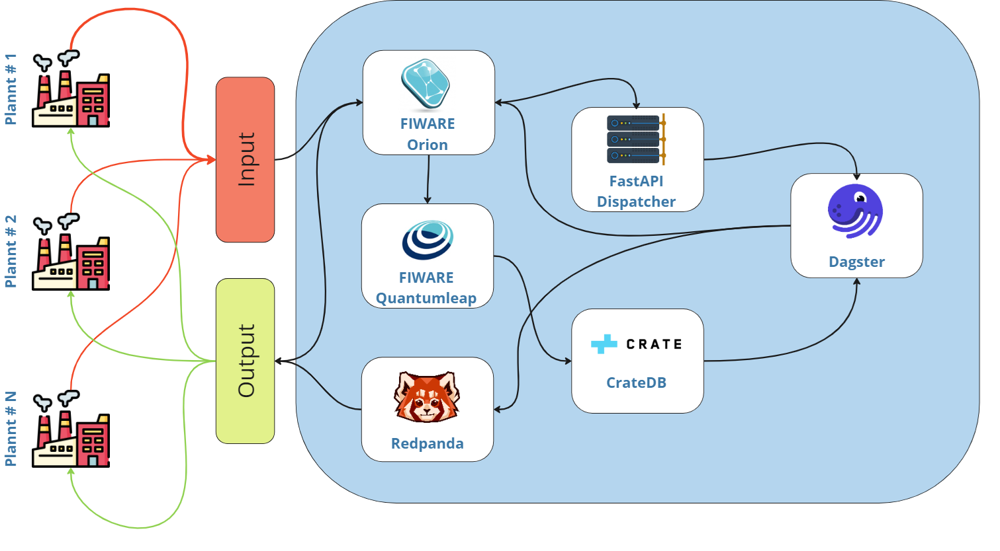

# Autonomic Manager (AM)

Autonomic Manager (AM) is an innovative toolkit comprising custom, reliable self-X AI technologies and applications. 
The Autonomic Manager with MAPE-K (Monitor, Analyze, Plan, Execute, Knowledge) methodology is a concept in the field of autonomic computing, which aims to create self-managing systems that can adapt to changing conditions, optimize performance, and maintain system health.

It's based on open-source FIWARE/Apache components, built on top of the [DIDA](https://github.com/Engineering-Research-and-Development/dida) (Digital Industries Data Analytics) platform. 
The Autonomic Manager has the role of autonomous AI Data pipeline coordinator and decision maker adopting MAPE-K framework and implementing the actual innovation lying on the Self-X capabilities.

It can interact with the applications layer to improve its functionalities and support the AI pipeline processing. 
The idea is to listen to events coming from context information to identify patterns described by rules, in order to immediately react upon them by autonomously triggering actions.

## Project reference architecture

The AM architecture is shown in the image above: it encompasses multiple data-provider (producers) that stream their data to a Fiware Orion server.
The entry-point of the architecture is the FastAPI server, namely "orion catcher".
Through a subscription mechanism, it catches the data from the producer, and dispatch them to dedicated Dagster pipelines that elaborate the business logic of the solutions.
According to each pipeline, the results are sent to Kafka or Fiware QuantumLeap to handle the next steps of the AM procedure.
Please refer to the following documents to develop a custom solution, or to dig the major functionalities.
## Documentation Contents

* [Main functionalities](docs/mainFunctionalities.md)
* [Useful tools](docs/usefulTools.md)
* [Requirements](docs/requirements.md)
* [How to run](docs/howToRun.md)
* [How to Setup Idm](docs/howToSetupIdm.md)
* [Extend the AM](docs/extendAM.md)

Autonomic Manager has received funding from the European Union's HORIZON-CL4-20-21-TWIN-TRANSITION-01 programme under grant agreements No 10.1058715 <https://s-x-ai-project.eu/>.

## License

The Digital Industry Data Analytics Platform is licensed under [Affero General Public License (GPL) version 3](https://github.com/Engineering-Research-and-Development/dida/blob/master/LICENSE).

© 2024 Engineering Ingegneria Informatica S.p.A.

### Are there any legal issues with AGPL 3.0? Is it safe for me to use?

No problem in using a product licensed under AGPL 3.0. Issues with GPL (or AGPL) licenses are mostly related with the
fact that different people assign different interpretations on the meaning of the term “derivate work” used in these
licenses. Due to this, some people believe that there is a risk in just _using_ software under GPL or AGPL licenses
(even without _modifying_ it).

For the avoidance of doubt, the owners of this software licensed under an AGPL 3.0 license wish to make a clarifying
public statement as follows:

"Please note that software derived as a result of modifying the source code of this software in order to fix a bug or
incorporate enhancements is considered a derivative work of the product. Software that merely uses or aggregates (i.e.
links to) an otherwise unmodified version of existing software is not considered a derivative work, and therefore it
does not need to be released as under the same license, or even released as open source."
