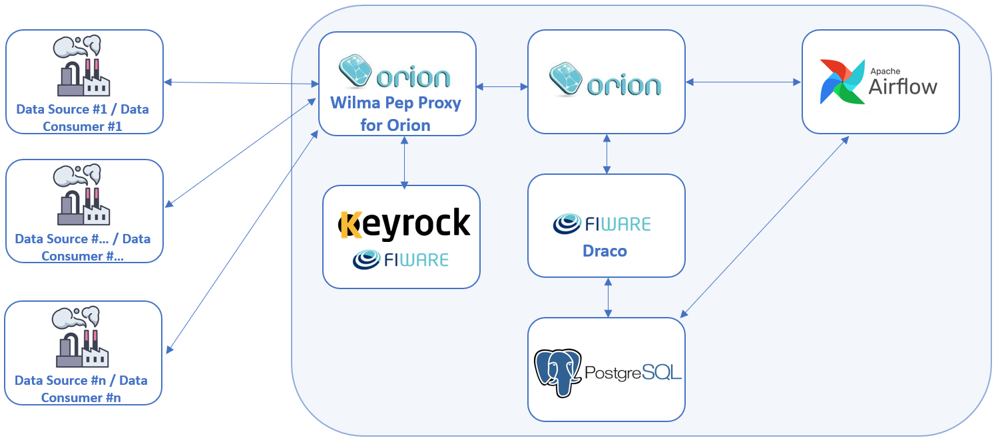

<h1>Autonomic Manager (AM)</h1>

In the context of s-X-AIPI Project borns the Autonomic Manager (AM) an innovative toolkit comprising custom, reliable self-X AI technologies and applications. The Autonomic Manager with MAPE-K (Monitor,Analyze, Plan, Execute, Knowledge) methodology is a concept in the field of autonomic computing, which aims to create with a powerful approach a self-managing systems that can adapt to changing conditions, optimize performance, and maintain system health.It is based on open source FIWARE/Apache components, built on top of the <a href="https://github.com/Engineering-Research-and-Development/dida">DIDA</a> (Digital Industries Data Analytics) platform.
The Autonomic Manager has the role of autonomous AI Data pipeline coordinator and decision maker adopting MAPE-K framework and implementing the actual innovation lying on the Self-X capabilities. It has the possibility also to interact with the applications layer to improve its functionalities and support the AI pipeline processing.

The idea is to listen to events coming from context information to identify patterns described by rules, in order to immediately react upon them by autonomously triggering actions.

The selected components to allow that kind of behaviours are:
- <b><a href="https://github.com/ging/fiware-draco">FIWARE Draco</a></b>: based on Apache NiFi. NiFi is a data-flow system based on the flow-based concept programming designed to automate the flow of data in systems and support direct and scalable graphics.
- <b><a href="https://github.com/FIWARE/context.Orion-LD">FIWARE ORION-LD Context Broker (OCB)</a></b>: an implementation of the Publish/Subscribe Broker Generic Enabler (GE), able to manage the entire lifecycle of context information including updates, queries, registrations, and subscriptions. It based on NGSI-LD server implementation to manage context information and its availability. This GE allows to create context elements and manage them through updates and queries, and to subscribe to context information receiving a notification when a condition is satisfied, for example in case of context change
- <b><a href="https://www.postgresql.org/">PostgreSQL</a></b>: a multiplatform relational database management system (RDBMS). It is an open-source able to manage distributed application cloud native and compatible with NGSI-LD and FIWARE Draco to archive context information.
- <b><a href="https://airflow.apache.org/">Apache Airflow</a></b>: an open-source workflow management platform. Creating Airflow allow to programmatically author and schedule workflows and monitor them via the built-in Airflow user interface. It is written in Python, and workflows are created via Python scripts. Airflow is designed under the principle of "configuration as code". While other "configuration as code" workflow platforms exist using markup languages like XML, using Python allows developers to import libraries and classes to help them create their workflows.
- <b><a href="https://github.com/FIWARE-GEs/keyrock">FIWARE KeyRock</a></b>: a FIWARE component for Identity Management. Using KeyRock (in conjunction with other security components such as PEP Proxy and Authzforce) it is added OAuth2-based authentication and authorization security to services and applications.
- <b><a href="https://github.com/ging/fiware-pep-proxy">FIWARE Wilma Pep Proxy</a></b>: combined with Keyrock, it enforces access control to OCB. This means that only permitted users will be able to access OCB entities based only specific permissions and policies.

 

## Documentation Contents

-   [Main functionalities](docs/mainFunctionalities.md)
-   [Useful tools](docs/usefulTools.md)
-   [Requirements](docs/requirements.md)
-   [How to run](docs/howToRun.md)
-   [How to Setup Idm](docs/howToSetupIdm.md)
-   [Metadata](/NGSI-LD-Entities/NGSI-LD-Entities.md)

 
Autonomic Manager has received funding from the European Union's HORIZON-CL4-2021-TWIN-TRANSITION-01 programme under grant agreements No  101058715 [s-X-AIPI](https://s-x-aipi-project.eu/) .
 
© 2023 Engineering Ingegneria Informatica S.p.A.

